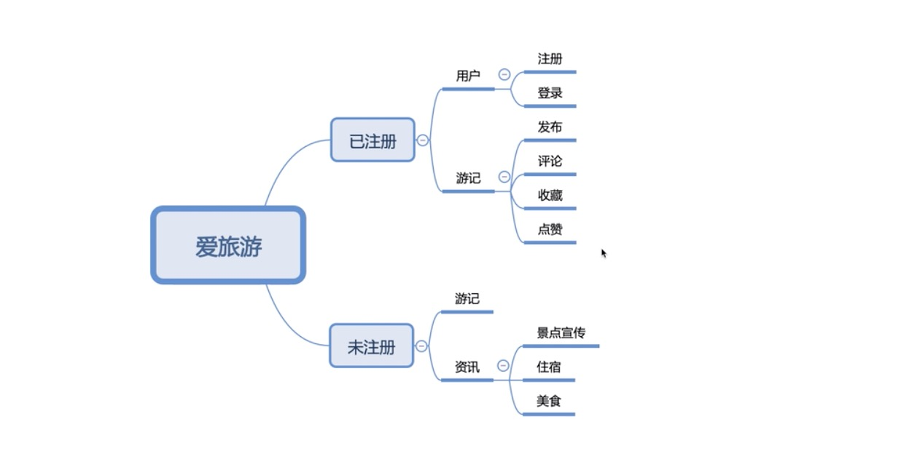

#### 游记(微信小程序)

#### 简介


#### Taro
```bash
# taro
https://taro-docs.jd.com/taro/docs/README.html
# 安装
$ npm install -g @tarojs/cli
$ yarn global add @tarojs/cli

# taro-ui
https://taro-ui.jd.com/#/docs/introduction

# 初始化项目
$ taro init myApp

# 安装taro-ui
$ cd myApp
$ npm install taro-ui

# 启动项目
# 1.微信:  "dev:weapp": "npm run build:weapp -- --watch",
npm run dev:weapp

# 或者(自己添加的):"wechat": "npm run build:weapp -- --watch",
npm run wechat / yarn wechat

# 其他常用命令
# yarn
$ yarn dev:weapp
$ yarn build:weapp
# npm script
$ npm run dev:weapp
$ npm run build:weapp
# 仅限全局安装
$ taro build --type weapp --watch
$ taro build --type weapp
# npx 用户也可以使用
$ npx taro build --type weapp --watch
$ npx taro build --type weapp

```

#### 开发

```bash
# 启动
npm run dev:weapp
# 微信开发者工具查看(实时更新)


```